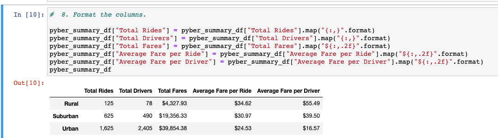
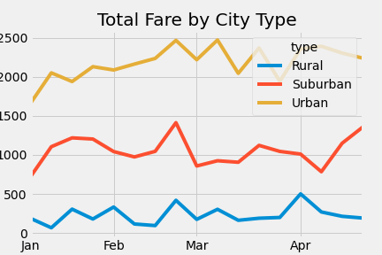

# PyBer_Analysis
Module 5  
## Overview: 

The purpose of this analysis was to create summaries of the total rides, total drivers, total fares, average fare per ride and average fare per driver for each of the three different city types, Rural, Suburban, and Urban. In addition to the total summaries and averages, the next part was to deliver a chart that showed the total weekly fares for each city type for a specific date period (January 2019 - April 2019).  

## Results: 

Looking at the data, Rural city types have the lowest total rides, total fares, and total drivers compared to Surban and Urban city types; however, they do have the highest average fare per ride and average fare per driver. This means that although they have the fewest rides and drivers, they have a higher cost than Suburban and Urban city types. Not surprisingly, Surban totals and averages are in between Rural and Urban for all summary metrics. While they don't have quite the amount of rides and drivers as Urban, they are closer to the average fare per ride and average fare per drive to Rural than Suburban. Finally, Urban has the highest rides and drivers but the lowest average fare per ride and average fare per driver which we can safely assume that people that ride in Urban city types are taking shorter trips overall than the other city types.   

**PyBer Summary**  

## Summary: 

In order to increase the average fare for Urban and Suburban areas, it may be wise to incentivize longer trips with discounts or coupons in order to try to persuade share-ride users to travel longer distances. Another takeaway is to try to capitalize on Rural areas by advertising the service more in order to boost rides taken especially since the average fare per rider and driver tend to be highest in the Rural areas. Lastly, Suburban areas was the only city type to drop in fares at the beginning of April, it may be profitable to focus media spend a few weeks before April in order to capture more fares like the other city types during this specific period. 

**PyBer Total Fares**  

